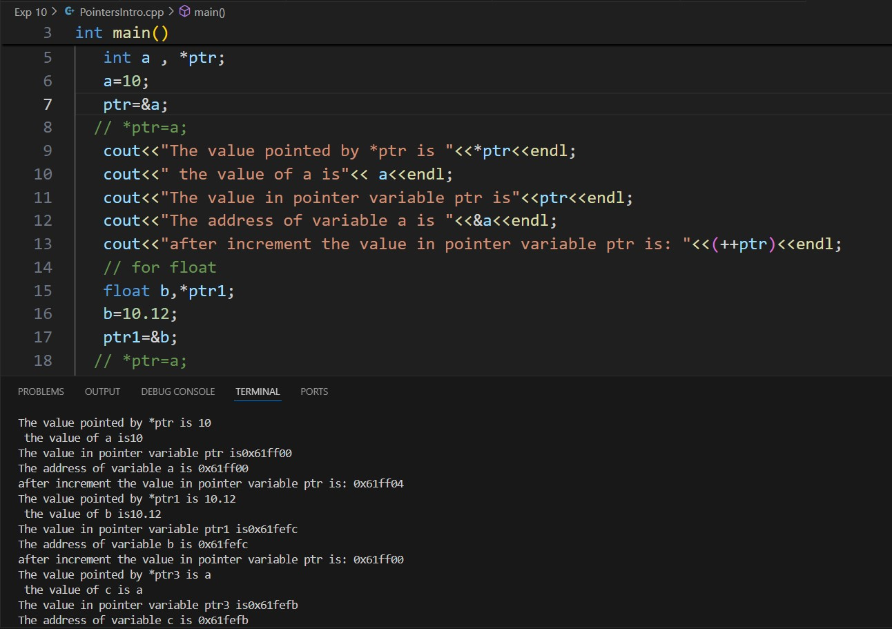
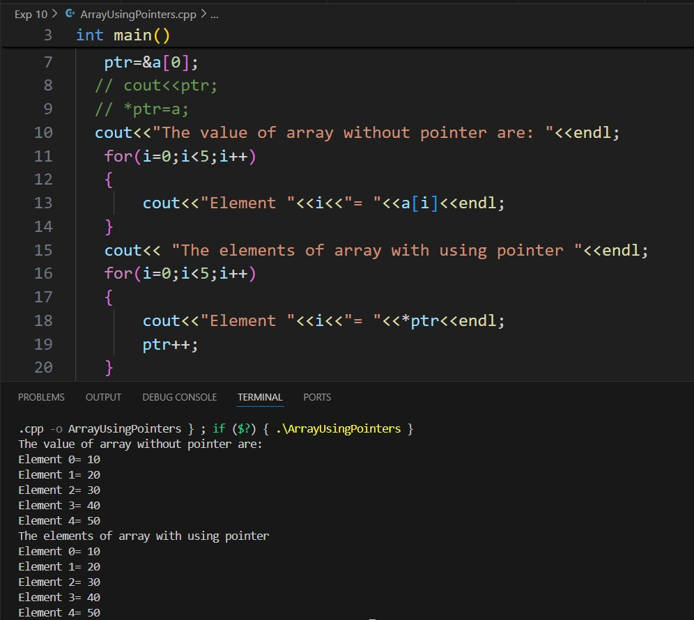
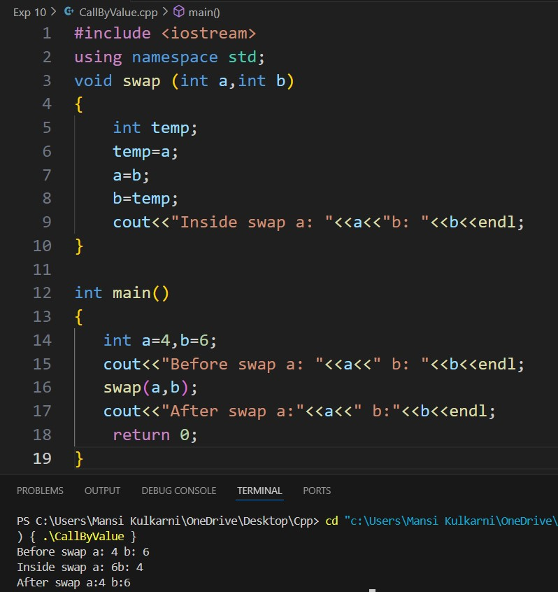
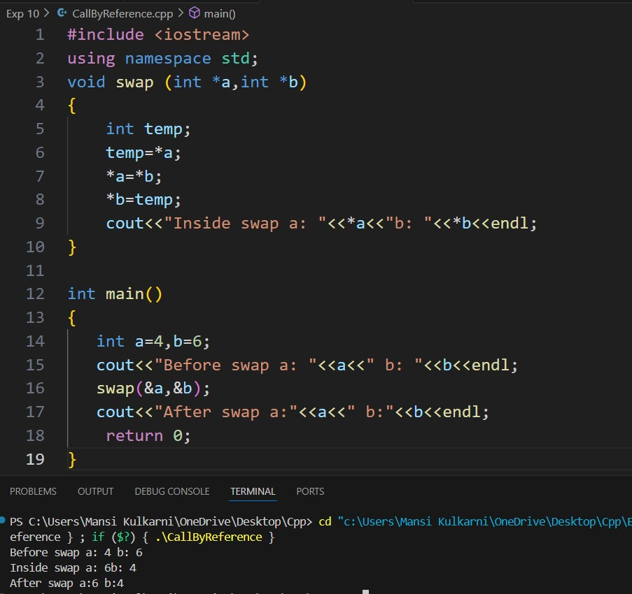

# Experiment 10
## Program 1
### Aim: 
Declare and initialize pointers of different data types and print the following values (Repeat for float and char data types)
### Software used: 
Visual Studio Code
### Theory:
A pointer in C++ is a variable that stores the memory address of another variable. Declaring a pointer involves specifying the data type of the variable it will point to, followed by an asterisk (*). Pointers must be initialized by assigning them the memory address of a variable using the address-of operator (&). Pointers play a crucial role in dynamic memory management, arrays, and efficient function parameter passing.
### Output:

### Conclusion:
We learned about pointers in C++. 

## Program 2
### Aim: 
Access array using pointer and without using pointer variable
### Software used: 
Visual Studio Code
### Theory:
In C++, pointers can be used to access elements of an array. When an array is declared, the name of the array acts as a pointer to the first element of the array. Using pointer arithmetic, you can traverse the array by incrementing the pointer to point to subsequent elements. This method is useful in cases where you want to process arrays in functions or manage dynamic memory.
### Output:

### Conclusion:
We learned how pointers work in arrays. 

## Program 3
### Aim: 
Swap the numbers using call-by-value
### Software used: 
Visual Studio Code
### Theory:
In the call-by-value mechanism, when a function is called, a copy of the actual arguments is passed to the function. The function works with these copies, and any modifications to the parameters inside the function do not affect the original variables outside the function. Call by value is simple and safe, as it prevents accidental changes to the original data, but it can be inefficient when passing large data structures.
### Output:

### Conclusion:
We learned about the call-by-value operation in C++. 

## Program 4
### Aim: 
Swap the numbers using call-by-reference. 
### Software used: 
Visual Studio Code
### Theory:
In the call-by-reference mechanism, instead of passing a copy of the arguments, the function receives references (or pointers) to the original variables. Any changes made to the parameters inside the function will directly affect the original variables. This method is more efficient for large data structures and allows functions to modify the caller's variables, but it requires caution to avoid unintended side effects.
### Output:

### Conclusion:
We learned about the call-by-reference in C++. 
